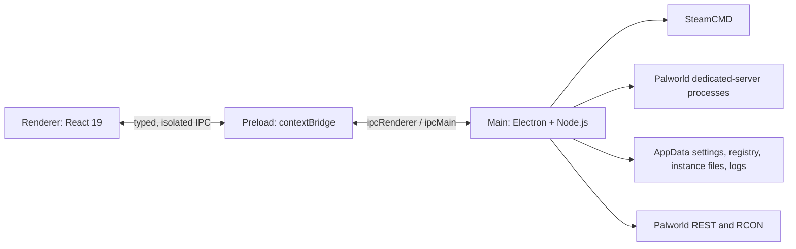

# PalServer Manager codebase

## Purpose

PalServer Manager is a local Electron desktop application for installing, configuring, starting, monitoring, and maintaining multiple Palworld dedicated-server instances. It uses SteamCMD for game-server installation and communicates with running servers through their REST and RCON interfaces. It does not provide a hosted service or remote-control backend.

## Supported distribution

Windows is the only packaged target at present. `npm run build:win` produces an NSIS installer with a multi-page, per-user installation flow. The installer allows the destination directory to be changed and offers desktop and Start-menu shortcuts.

The active electron-builder configuration is the `build` block in `package.json`; it specifies the NSIS target, wizard settings, and `resources/icon.ico`. `electron-builder.yml` is retained as a matching reference configuration. There is intentionally no Linux build target or `build:linux` command.

## Architecture

### Main process

`src/main/index.ts` creates the window, applies the production CSP, initializes logging and SteamCMD, loads the instance registry, registers IPC handlers, and stops monitors and managed server processes before the application quits. The BrowserWindow uses `sandbox: true`, `contextIsolation: true`, and `nodeIntegration: false`.

`src/main/services/` contains the application logic:

- `server/instance.ts` represents an individual server and owns its install, start, stop, RCON, and status behavior.
- `server/instanceManager.ts` loads, creates, updates, deletes, and stops instances.
- `engine/steamcmd.ts` installs or updates server files through a serialized SteamCMD queue.
- `engine/templateManager.ts` maintains the reusable server template used when creating instances.
- `server/iniConfig.ts` and `server/palworldSchema.ts` support structured editing of `PalWorldSettings.ini`.
- `server/palworldApi.ts`, `server/rconClient.ts`, `server/playerDatabase.ts`, and `system/monitor.ts` provide live server data and player-management behavior.
- `system/processControl.ts`, `system/ports.ts`, and `system/logger.ts` handle process lifecycle, port checks, and persistent logs.

`src/main/ipcs/` is the main-process boundary. It registers handlers for instances, server control, files, players, and the template installer; UI code should not bypass this layer to access Node APIs.

### Preload and renderer

`src/preload/index.ts` exposes the deliberately limited `window.palServerManager` API through `contextBridge`. It contains the IPC channel names used by the renderer and subscription helpers that clean up their listeners.

`src/renderer/src/` is the React UI:

- `App.tsx` owns the high-level list/detail navigation and global UI state.
- `pages/InstanceList.tsx` creates, lists, starts, and manages server instances.
- `pages/InstanceDetail.tsx` hosts the per-instance tabs.
- `components/ServerManagement/` contains the dashboard, configuration, terminal, players, file-manager, and log-viewer screens.
- `components/Shared/` contains shared dialogs, icons, install progress, and file-editing UI.
- `api/` wraps the preload API for use in components; it is the renderer-side contract layer.

## IPC contract

The preload API maps the following groups to asynchronous `ipcMain.handle` channels:

| Area           | Channels                                                                                                                                                                |
| -------------- | ----------------------------------------------------------------------------------------------------------------------------------------------------------------------- |
| Instances      | `instances:list`, `instances:get`, `instances:create`, `instances:update`, `instances:delete`, `instances:getSettingsSchema`, `instances:sendRcon`, `system:openFolder` |
| Server control | `control:start`, `control:stop`, `control:kill`, `control:trimRam`, `control:logs`                                                                                      |
| Files          | `fs:readdir`, `fs:readFile`, `fs:writeFile`, `fs:upload`, `fs:delete`, `fs:rename`, `fs:mkdir`, `fs:mkfile`, `fs:archive`, `fs:unarchive`, `fs:openInExplorer`          |
| Template       | `template:getStatus`, `template:install`                                                                                                                                |
| Players        | `players:list`, `players:kick`, `players:ban`, `players:unban`, `players:announce`                                                                                      |

The main process emits `instance:status`, `instance:log`, and `template:progress` events. File operations are scoped to the selected instance's installation directory; path traversal is rejected before a file operation proceeds.

## Local data and process lifecycle

The data root is Electron's `app.getPath('userData')`. `app-settings.json` stores the configured data root and default instance directory. The registry, SteamCMD installation, template, server-instance configuration, player data, and application logs all reside under this application-managed data area or the selected instance installation.

Server processes are started from `ServerInstance`. The control service retains recent output for the terminal UI and runs a monitor for active instances. A normal application shutdown stops monitors and calls `InstanceManager.stopAll()` before Electron exits.

## Development, validation, and release

| Command                | Purpose                                                    |
| ---------------------- | ---------------------------------------------------------- |
| `npm run dev`          | Start the development application.                         |
| `npm run format:check` | Verify Prettier formatting without changing files.         |
| `npm run lint`         | Run ESLint.                                                |
| `npm run typecheck`    | Type-check main and renderer projects.                     |
| `npm run test:all`     | Run the Vitest suite with coverage.                        |
| `npm run build`        | Type-check and create the Electron/Vite production output. |
| `npm run build:win`    | Build the Windows NSIS installer.                          |

`.github/workflows/ci.yml` runs formatting, linting, type checking, and a Windows build on every push and pull request. A successful push to the repository's default branch updates the single rolling GitHub release tagged `latest`, replacing the installer asset with the new build.

## Tests

Vitest tests are organized by application concern under `tests/`: server lifecycle, instance management, configuration, file management, player management, SteamCMD/template behavior, monitoring, and IPC contracts. Tests use isolated mocks and temporary data where starting an actual dedicated server would be impractical.

## Current project status

The earlier installer, icon, Linux-packaging, formatting, CI, and release-publication issues are resolved. The repository's open-issues register is intentionally empty; new work should be tracked in GitHub Issues rather than added as undocumented notes in this file.
