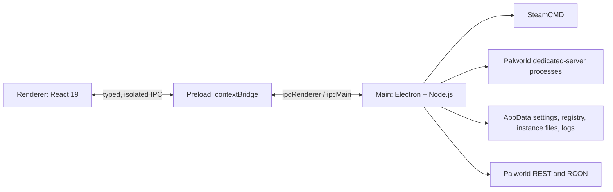

# PalServer Manager codebase

## Purpose

PalServer Manager is a local Electron desktop application for installing, configuring, starting, monitoring, and maintaining multiple Palworld dedicated-server instances. It uses SteamCMD for game-server installation and communicates with running servers through their REST and RCON interfaces. It does not provide a hosted service or remote-control backend.

## Supported distribution

Windows is the only packaged target at present. `npm run build:win` produces an NSIS installer with a multi-page, per-user installation flow. The installer allows the destination directory to be changed and offers desktop and Start-menu shortcuts.

The active electron-builder configuration is the `build` block in `package.json`; it specifies the NSIS target, wizard settings, and `resources/icon.ico`. `electron-builder.yml` also exists at the repository root but has drifted from `package.json` (different `appId` and `productName` values) — it is not currently read by any build script and should not be treated as an authoritative reference until reconciled or removed. There is intentionally no Linux build target or `build:linux` command, though some internal path-handling code still contains Linux-specific branches (see "Cross-platform code that isn't shipped," below).

## Architecture

### Main process

`src/main/index.ts` creates the window, applies the production CSP, initializes logging and SteamCMD, loads the instance registry, registers IPC handlers, and stops monitors and managed server processes before the application quits. The `BrowserWindow` uses `sandbox: true`, `contextIsolation: true`, and `nodeIntegration: false`.

The production Content-Security-Policy (applied only when `app.isPackaged`, via `session.defaultSession.webRequest.onHeadersReceived`) allows the app's own origin plus a fixed set of external hosts: `cdn.jsdelivr.net` (scripts/styles/fonts), `fonts.googleapis.com` and `fonts.gstatic.com` (fonts), and `ipv4.icanhazip.com` (the only external `connect-src` host outside the font/CDN set — used for public IP lookup). Any new external dependency (a different CDN, API, or font host) requires updating this CSP string or it will be silently blocked in packaged builds.

`src/main/services/` contains the application logic:

- `server/instance.ts` represents an individual server and owns its install, start, stop, RCON, and status behavior.
- `server/instanceManager.ts` loads, creates, updates, deletes, and stops instances.
- `engine/steamcmd.ts` installs or updates server files through a serialized SteamCMD queue.
- `engine/templateManager.ts` maintains the reusable server template used when creating instances.
- `server/iniConfig.ts` and `server/palworldSchema.ts` support structured editing of `PalWorldSettings.ini`.
- `server/palworldApi.ts`, `server/rconClient.ts`, `server/playerDatabase.ts`, and `system/monitor.ts` provide live server data and player-management behavior.
- `system/processControl.ts`, `system/ports.ts`, and `system/logger.ts` handle process lifecycle, port checks, and persistent logs.

`src/main/ipcs/` is the main-process boundary. It registers handlers for instances, server control, files, players, and the template installer; UI code should not bypass this layer to access Node APIs. `src/main/ipcs/core/settings.ts` is the one exception to the "ipcs registers handlers" pattern — it exposes plain functions (`getSettings`, `saveSettings`, `getDataRoot`) called directly by `index.ts` during startup, and registers no IPC channels of its own.

### Preload and renderer

`src/preload/index.ts` exposes the deliberately limited `window.palServerManager` API through `contextBridge`. It contains the IPC channel names used by the renderer and subscription helpers that clean up their listeners.

`src/renderer/src/` is the React UI:

- `App.tsx` owns the high-level list/detail navigation and global UI state.
- `pages/InstanceList.tsx` creates, lists, starts, and manages server instances.
- `pages/InstanceDetail.tsx` hosts the per-instance tabs.
- `components/ServerManagement/` contains the dashboard, configuration, terminal, players, file-manager, and log-viewer screens.
- `components/Shared/` contains shared dialogs, icons, install progress, and file-editing UI.
- `components/TemplateEngine/` contains the template-installation modal.
- `api/` wraps the preload API for use in components; it is the renderer-side contract layer.

## IPC contract

The preload API maps the following groups to asynchronous `ipcMain.handle` channels:

| Area           | Channels                                                                                                                                                                |
| -------------- | ----------------------------------------------------------------------------------------------------------------------------------------------------------------------- |
| Instances      | `instances:list`, `instances:get`, `instances:create`, `instances:update`, `instances:delete`, `instances:getSettingsSchema`, `instances:sendRcon`, `system:openFolder` |
| Server control | `control:start`, `control:stop`, `control:kill`, `control:trimRam`, `control:logs`                                                                                      |
| Files          | `fs:readdir`, `fs:readFile`, `fs:writeFile`, `fs:upload`, `fs:delete`, `fs:rename`, `fs:mkdir`, `fs:mkfile`, `fs:archive`, `fs:unarchive`, `fs:openInExplorer`          |
| Template       | `template:getStatus`, `template:install`                                                                                                                                |
| Players        | `players:list`, `players:kick`, `players:ban`, `players:unban`, `players:announce`                                                                                      |

The main process emits three events to the renderer via `webContents.send`: `instance:log` and `instance:status` from `src/main/ipcs/server/control.ts`, and `template:progress` from `src/main/ipcs/engine/template.ts`. File operations are scoped to the selected instance's installation directory; `resolveSafePath` (in `src/main/ipcs/server/fs.ts`) rejects path traversal before a file operation proceeds.

Adding or changing a channel touches four places that must be kept in sync: the handler in `src/main/ipcs/`, the underlying logic in `src/main/services/`, the bridge and its typings in `src/preload/index.ts` / `index.d.ts`, and the renderer wrapper in `src/renderer/src/api/`.

## Cross-platform code that isn't shipped

Although the packaged product is Windows-only, two files contain Linux-specific branches that are currently unreachable in a shipped build:

- `src/main/services/system/processControl.ts` has a Linux-path comparison branch (`linuxTarget`) inside its process-matching logic.
- `src/main/ipcs/server/fs.ts` branches on `os.platform() === 'win32'` for archive/unarchive, falling back to `tar` when not on Windows.

This is not a bug on its own, but it means the "Windows only" claim in this document and the README describes the packaging target, not a hard platform check baked into every code path. Anyone relying on this code running only on Windows should not assume the absence of a platform guard elsewhere in the same file.

## Local data and process lifecycle

The data root is Electron's `app.getPath('userData')`. `app-settings.json` (written by `src/main/ipcs/core/settings.ts`) stores the configured data root and default instance directory. The registry, SteamCMD installation, template, server-instance configuration, player data, and application logs all reside under this application-managed data area or the selected instance installation. Logs specifically are written to `app.getPath('logs')` (`src/main/services/system/logger.ts`), a separate Electron-managed path from `userData`.

Server processes are started from `ServerInstance`. The control service retains recent output for the terminal UI and runs a monitor for active instances. A normal application shutdown (`app.on('before-quit')` in `src/main/index.ts`) stops all monitors and calls `InstanceManager.stopAll()` before Electron exits; the handler guards against re-entry by nulling `instanceManager` before calling `app.quit()` again.

## Development, validation, and release

| Command                | Purpose                                                                 |
| ----------------------- | ------------------------------------------------------------------------ |
| `npm run dev`           | Start the development application.                                     |
| `npm run format:check`  | Verify Prettier formatting without changing files.                     |
| `npm run lint`          | Run ESLint.                                                             |
| `npm run typecheck`     | Type-check main/preload (`typecheck:node`) and renderer (`typecheck:web`) projects in sequence. |
| `npm run test:all`      | Run the full Vitest suite with coverage.                                |
| `npm run test:<area>`   | Run one feature area's tests only — see "Tests," below, for the list.  |
| `npm run build`         | Type-check, then create the Electron/Vite production output.           |
| `npm run build:win`     | Build and produce the Windows NSIS installer.                          |

`.github/workflows/ci.yml` runs formatting, linting, type checking, and the full test suite on every push and pull request (the `quality` job). A Windows installer build and release publish only run on push to `main` or `dev`, gated on `quality` passing: pushes to `main` publish/update the Stable release (tag `v<version>` from `package.json`, failing the run if that version's release already exists), and pushes to `dev` publish/update the rolling `experimental` pre-release. See `docs/WORKFLOW.md` for the full branch and release workflow.

## Tests

Vitest tests are organized by application concern under `tests/`, each area split into `unit/` and/or `integration/`:

| Area                     | Folder                             | `npm run` script  |
| ------------------------- | ------------------------------------ | ------------------- |
| Server lifecycle          | `tests/server-lifecycle/`           | `test:lifecycle`   |
| Instance management      | `tests/instance-management/`        | `test:instances`   |
| Configuration             | `tests/configuration/`              | `test:config`      |
| File management           | `tests/file-manager/`               | `test:files`       |
| Player management         | `tests/player-management/`          | `test:players`     |
| SteamCMD / templates      | `tests/steamcmd-and-templates/`     | `test:steamcmd`    |
| Monitoring                | `tests/monitor-and-metrics/`        | `test:monitor`     |
| IPC contracts              | `tests/ipc-contract/`               | `test:ipc`         |

Tests use isolated mocks and temporary directories (`os.tmpdir()`) where starting an actual dedicated server or touching real application data would be impractical.

## Current project status

The earlier installer, icon, Linux-packaging, formatting, CI, and release-publication issues are resolved. The known open items at time of writing are the `electron-builder.yml` drift described above and the unreachable Linux branches described in "Cross-platform code that isn't shipped." The repository's open-issues register is otherwise intentionally empty; new work should be tracked in GitHub Issues rather than added as undocumented notes in this file.